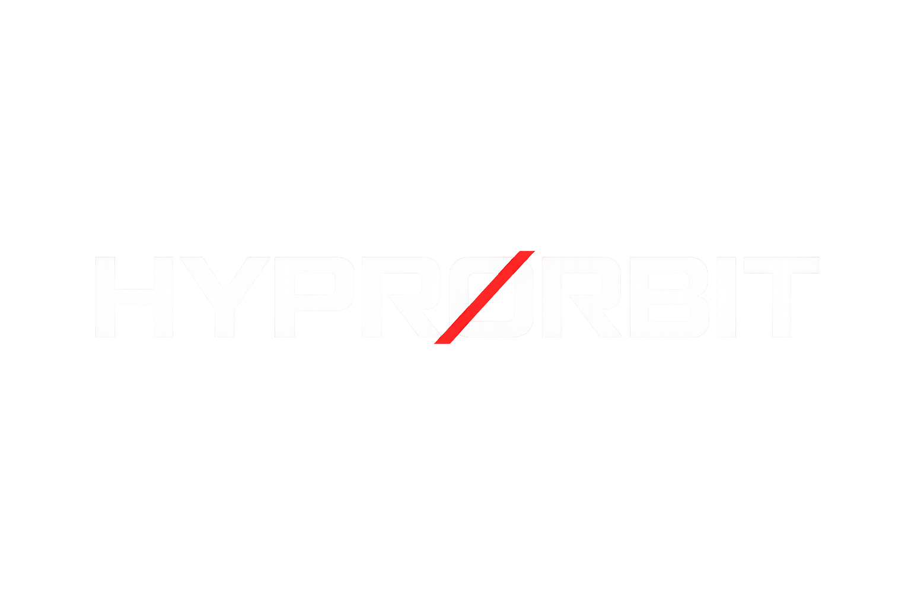

<!-- PROJECT LOGO -->
<div align="center">
    
<h2 align="center">hyprorbit v0.1.1</h2>

<!-- DISCLAIMER -->
⚠️ **This is experimental!** ⚠️ 

  <p align="center">
Lightweight workspace orchestration for <a href="https://github.com/hyprwm/Hyprland">Hyprland</a> power users.
    <br>

**hyprorbit** is a stateful daemon + client system for Hyprland workspace management, written in Go.

<br>

<a href="https://github.com/xarcdotdev/hyprorbit/issues/new?labels=bug&template=bug-report---.md">Report Bug</a>
&middot;
<a href="https://github.com/xarcdotdev/hyprorbit/issues/new?labels=enhancement&template=feature-request---.md">Request Feature</a>
  </p>

[![Contributors][contributors-shield]][contributors-url]
[![Go][Go-shield]][Go.dev]
[![Stargazers][stars-shield]][stars-url]
[![Issues][issues-shield]][issues-url]
[![License][license-shield]][license-url]

</div>

## What is hyprorbit?

Switching projects in Hyprland can break your layout - windows scatter and workspace hotkeys change meaning. **hyprorbit** introduces **orbits** - mirrored workspace sets with identical keybindings. Switch between **work**, **personal**, or **debug** modes instantly while keeping muscle memory intact.

**Core idea:**
- Each app → fixed workspace  
- Each workspace → consistent hotkey  
- Some apps are **global**, others need an instance **per-context** 

```bash
hyprorbit module jump code   # jump to your code workspace  
hyprorbit module focus comm  # focus or launch your comm app  
hyprorbit orbit next         # switch orbit 
```

<!-- <div align="center">
![Demo][cli-screenshot]
</div> -->

### Key Features

- **Orbit contexts** - separate sets of workspaces for different projects
- **Stable hotkeys** - same workspace-keybindings across all orbits
- **Focus-or-launch** - focus windows in current orbit instead of launching
- **Very low latency** via persistent daemon

## Quickstart

### 1. Prerequisites

- [Hyprland](https://hyprland.org/) compositor
- Go 1.21+

### 2. Install

```sh
# Clone and build
git clone https://github.com/xarcdotdev/hyprorbit.git
cd hyprorbit
make

# Install to PATH (recommended)
sudo cp hyprorbit hyprorbitd /usr/local/bin/
```

### 3. Start Daemon

```sh
# Recommended: via Hyprland Config (order is important here)
exec-once = hyprorbitd # start daemon
exec-once = hyprorbit init --autostart # for workspace initialization

# Or manually for testing
./hyprorbitd

# Or with custom config
./hyprorbitd --config ~/.config/hyprorbit/config.yaml
```

### 4. Configure Hyprland Keybinds

Add to your `~/.config/hypr/hyprland.conf`:

→ [Example Hyprland Keybindings](docs/example_keybindings.conf)

```bash
# Quick workspace jumping (stable across orbits)
bind = SUPER, 1, exec, hyprorbit module jump code
bind = SUPER, 2, exec, hyprorbit module focus comm
bind = SUPER, 3, exec, hyprorbit module focus gfx

# Orbit switching
bind = SUPER, comma, exec, hyprorbit orbit prev
bind = SUPER, period, exec, hyprorbit orbit next
bind = SUPER ALT, 1, exec, hyprorbit orbit set alpha
bind = SUPER ALT, 2, exec, hyprorbit orbit set beta

# Focus Applications
bind = SUPER, C, exec, hyprorbit module focus coding
bind = SUPER, E, exec, hyprorbit module focus email

# Create temporary workspace inside of orbit & move focused window there
bind = SUPER, N, exec, hyprorbit window move current module:create

# Move all windows on current workspace to specific module in another orbit
bind = SUPER ALT, 1, exec hyporbit window move workspace orbit:alpha/module:code

# Move all windows (globally) to first module workspace of current orbit
bind = SUPER ALT CTRL, M, exec hyprorbit window move all module:index:1
```

See `hyprorbit --help` for full options.

<p align="right">(<a href="#readme-top">back to top</a>)</p>

## Usage

### Core Concepts

**Orbits**: Independent workspace contexts (e.g., `alpha`, `beta`, `gamma`)
- Separate environments for different projects/contexts
- Default labels: α, β, γ
- Each orbit maintains its own window instances

**Modules**: Workspace categories bound to consistent hotkeys (e.g., `code`, `comm`, `gfx`)
- `SUPER+1` → "code" module in whichever orbit you're in
- Generate orbit-specific workspaces: `code-alpha`, `comm-beta`, etc.
- Windows bind to modules via pattern matching

### Commands

→ [Full Command Reference](docs/COMMANDS.md)

| Command            | Description                                     |
| ------------------ | ----------------------------------------------- |
| `hyprorbit orbit get`    | Show current active orbit                      |
| `hyprorbit orbit set <name>` | Switch to specific orbit                   |
| `hyprorbit orbit next/prev` | Cycle through configured orbits             |
| `hyprorbit module focus <name>` | Smart focus-or-launch for module        |
| `hyprorbit module jump <name>` | Simple workspace switching               |
| `hyprorbit window move <window> <target>` | Move/focus windows across modules and orbits |

## Configuration

### File Location
- **Default**: `~/.config/hyprorbit/config.yaml`
- **Override**: `--config <path>` flag
- **Environment**: `HYPR_ORBITS_SOCKET` for custom socket path

### Configuration Schema

→ [Config Schema](docs/CONFIG.md)

## Waybar

→ [Waybar Setup](docs/WAYBAR.md)

**Waybar example:**

`~/.config/waybar/config.jsonc`

```jsonc
"custom/hyprorbit#orbit": {
  "format": "{text}-{alt}",
  "return-type": "json",
  "exec": "hyprorbit module watch --waybar --waybar-config ~/.config/hyprorbit/waybar.yaml",
  "restart-interval": 0,
  "escape": true,
  "max-length": 20,
  "on-click": "hyprorbit orbit next",
  "on-click-right": "hyprorbit orbit prev",
  "tooltip": true
}
```

`~/.config/hyprorbit/waybar.yaml`

```yaml
module_watch:
  text: ["module", "workspace"]
  tooltip: ["orbit_label", "workspace"]
  alt: ["workspace"]
  class:
    sources: ["module", "orbit"]
```

<p align="right">(<a href="#readme-top">back to top</a>)</p>

## Roadmap

### Current Status
- ✅ Initial Configuration system
- ✅ Orbit management
- ✅ Module focus/jump commands
- ✅ Window matching system
- ✅ Shell Completion Script
- ✅ Waybar/status support
- ✅ Multi Monitor Support
- ✅ Client-server architecture (IPC)
- ✅ Module seeding (populate workspace with multiple apps)
- ✅ Support for Hyprland tag for adressing windows
- ✅ Global window targeting with `--global` flag for cross-orbit window operations

### Planned Features
- [ ] Add config for assigning workspaces/modules to monitors
- [ ] Make Orbit-Alignment across monitors optional (Have independent orbits on each monitor)
- [ ] Add window destroy command for orbit/workspace based cleanup
- [ ] Configurable notifications  

## Contributing

Issues and PRs welcome!

### Development
```sh
# Clone repository
git clone https://github.com/xarcdotdev/hyprorbit.git
cd hyprorbit

# Build both binaries
make

# Run tests
make test
```

## License

This project is licensed under the MIT License.
See `LICENSE` for details.

<p align="right">(<a href="#readme-top">back to top</a>)</p>

<!-- MARKDOWN LINKS & IMAGES -->
[contributors-shield]: https://img.shields.io/github/contributors/xarcdotdev/hyprorbit.svg?style=for-the-badge
[contributors-url]: https://github.com/xarcdotdev/hyprorbit/graphs/contributors
[forks-shield]: https://img.shields.io/github/forks/xarcdotdev/hyprorbit.svg?style=for-the-badge
[forks-url]: https://github.com/xarcdotdev/hyprorbit/network/members
[stars-shield]: https://img.shields.io/github/stars/xarcdotdev/hyprorbit.svg?style=for-the-badge
[stars-url]: https://github.com/xarcdotdev/hyprorbit/stargazers
[issues-shield]: https://img.shields.io/github/issues/xarcdotdev/hyprorbit.svg?style=for-the-badge
[issues-url]: https://github.com/xarcdotdev/hyprorbit/issues
[license-shield]: https://img.shields.io/github/license/xarcdotdev/hyprorbit.svg?style=for-the-badge
[license-url]: https://github.com/xarcdotdev/hyprorbit/blob/master/LICENSE
[product-screenshot]: docs/images/demo.gif

[Go.dev]: https://go.dev/
[Go-shield]: https://img.shields.io/badge/Go-00ADD8?style=for-the-badge&logo=go&logoColor=white
